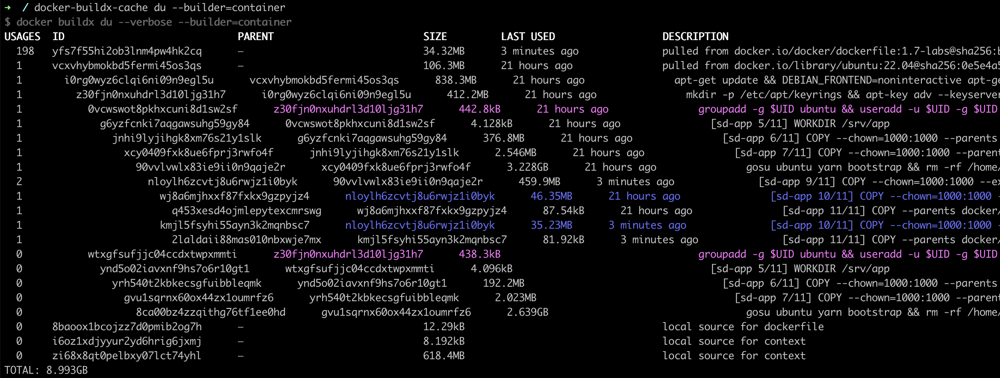

# docker-buildx-cache: Improved version of "docker buildx du" and "docker buildx prune"

```
usage: docker-buildx-cache [-h] [--builder BUILDER]
                           [--description-len DESCRIPTION_LEN]
                           [--verbose] [--until UNTIL]
                           {du,prune}

When "du" action is run, calls "docker builds du --verbose" under
the hood and represents its output in a "forest" form. Cache layers
are displayed with corresponding nesting. Colors are used to
highlight layers with common parents.

When "prune" action is run, calls "docker buildx prune", then
analyzes its output, the output of du, and additionally calls
"docker buildx prune" again to prune even more layers. If --verbose
is used, prints "before" and "after" forests. This action exists to
work-around the default pruning mis-behavior explained here:
https://github.com/moby/buildkit/issues/5436

positional arguments:
  {du,prune}            action to perform

options:
  -h, --help            show this help message and exit
  --builder BUILDER     builder name passed to the underlying
                        "docker buildx" commands (default: None)
  --description-len DESCRIPTION_LEN
                        shorten the description of each layer to
                        this length (default: 70)
  --verbose             print detailed colorful output (default:
                        False)
  --until UNTIL         required for "prune" action; holds numeric
                        timestamp, ISO date timestamp or duration
                        string; only the layers older than this
                        timestamp will be pruned (default: None)
```


